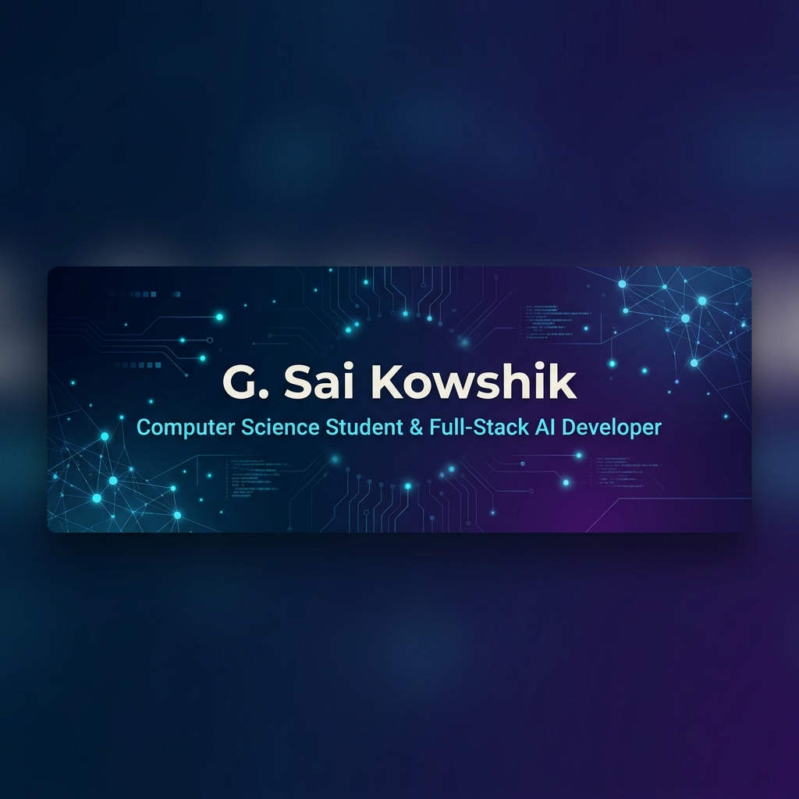

  

  # Hello World! I'm Gandikota Sai Kowshik 👋
  
  ### 🚀 Full-Stack AI Developer & CS Student
  
  **🤖 AI Enthusiast • 🧩 Problem Solver • ⚡ Quick Learner • 👥 Team Player**
  
  *"Building AI Products That Solve Real Problems"*
  
  
  <!-- NOTE: If your LinkedIn username is different, please replace 'gsaikowshik' in the URL above with your actual username -->
  

---

## 👨‍💻 About Me
I operate at the intersection of **Web Development** and **Artificial Intelligence**, combining strong academic foundations with hands-on experience. I actively employ AI-augmented engineering practices to accelerate development, optimize workflows, and tackle complex logical challenges.

🎓 **Education:** Pursuing B.Tech in Computer Science at **Vishnu Institute of Technology**, Bhimavaram (2023 - 2027).

---

## 💼 Recent Experience
* 🚀 **AI Web Developer Intern** @ *InAmigos Foundation*
* ☁️ **AWS GEN AI Intern** @ *AWS Academy & Edunet Foundation*

---

## 🛠️ Tech Stack & Skills

### 💻 Languages & Environments

### ⚙️ Frameworks & Libraries

### 🧠 AI / Machine Learning

### 💾 Databases & Backend Services

### 🔧 Tools & Workflow

---

## 🚀 Key Projects

| Project | Description | Tech Stack | Status / Highlight |
| :--- | :--- | :--- | :--- |
| **💡 DayZero AI** | Startup idea validation platform providing AI-driven market analysis. | React, FastAPI, Supabase, OpenAI API | *In Development* |
| **♻️ Waste Vision** | AI system for automated waste classification using deep learning. | Python, YOLOv8, Streamlit | *Deployed / Active* |
| **📄 INSTA REPO** | AI-powered builder that creates instant resumes and developer portfolios. | Python, Streamlit, Gemini API | *Live* |

---

## 📊 GitHub Analytics

  &nbsp;&nbsp;
  

---

  <h3>Let's Connect & Collaborate!</h3>
  
  
  &nbsp;&nbsp;
  

